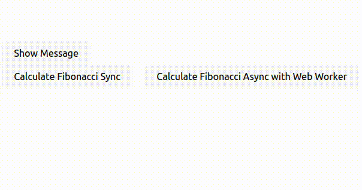

## Web workers

**Trường hợp không sử dụng web workers**. Ta có thể thấy khi bấm vào nút **Show Message** thì không active mà cần phải đợi in kết quả ra mới active được, do đang phải xử lý chức năng khác (xử lý động bộ)



**Trường hợp sử dụng web workers**. Xử lý bất đồng bộ, chức năng này đang hoạt động không ảnh hưởng tới các chức năng khác


## Code

**Luồng chức năng chính:**

1. Main thread gửi số cần tính qua `worker.postMessage(NUMBER)`.

2. Worker tính Fibonacci và gửi kết quả về.

4. Main thread nhận kết quả qua sự kiện `worker.onmessage` và cập nhật giao diện.


**Chi tiết hơn:**

Ta có hàm tính toán fibonacci

```tsx
const fibonacci = (n: number): number => {
    if (n <= 1) return n;
    return fibonacci(n - 1) + fibonacci(n - 2);
};
```

và hàm hiển thị message khi bấm vào **Show Message**

```tsx
const handleNewButtonClick = () => {
    setShowMessage(true);
};
```

- **Trường hợp không sử dụng web workers**

```tsx
 const calculateSync = () => {
    setSyncLoadings((prev) => [...prev, true]); // Add loading
    const start = performance.now();
    const result = fibonacci(NUMBER);
    const end = performance.now();
    setFibSync((prev) => [...prev, result]);
    setTimeSync((prev) => [...prev, end - start]);
    setSyncLoadings((prev) => prev.slice(1)); // Remove loading
};
```

Ta có thể thấy các tính toán được thực hiện đồng bộ

- **Trường hợp sử dụng web workers**

Thiết lập Web Worker trong `useEffect`

```tsx
useEffect(() => {
    workerRef.current = new Worker(new URL("./fibWorker.js", import.meta.url));
    workerRef.current.onmessage = (e) => {
      const { result, time } = e.data;
      setFibAsync((prev) => [...prev, result]);
      setTimeAsync((prev) => [...prev, time]);
      setAsyncLoadings((prev) => prev.slice(1)); // Remove loading
    };
    return () => {
      workerRef.current?.terminate();
    };
}, []);
```

Yêu cầu worker tính toán Fibonacci

```tsx
const calculateAsync = () => {
    setAsyncLoadings((prev) => [...prev, true]); // Add loading
    workerRef.current?.postMessage(NUMBER);
};
```

Tính giá trị Fibonacci của số n trong worker thread. Gửi kết quả và thời gian thực hiện về main thread.

```tsx
self.onmessage = (e) => {
  const n = e.data;
  const start = performance.now();
  const result = fibonacci(n);
  const end = performance.now();
  self.postMessage({ result, time: end - start });
};
```


